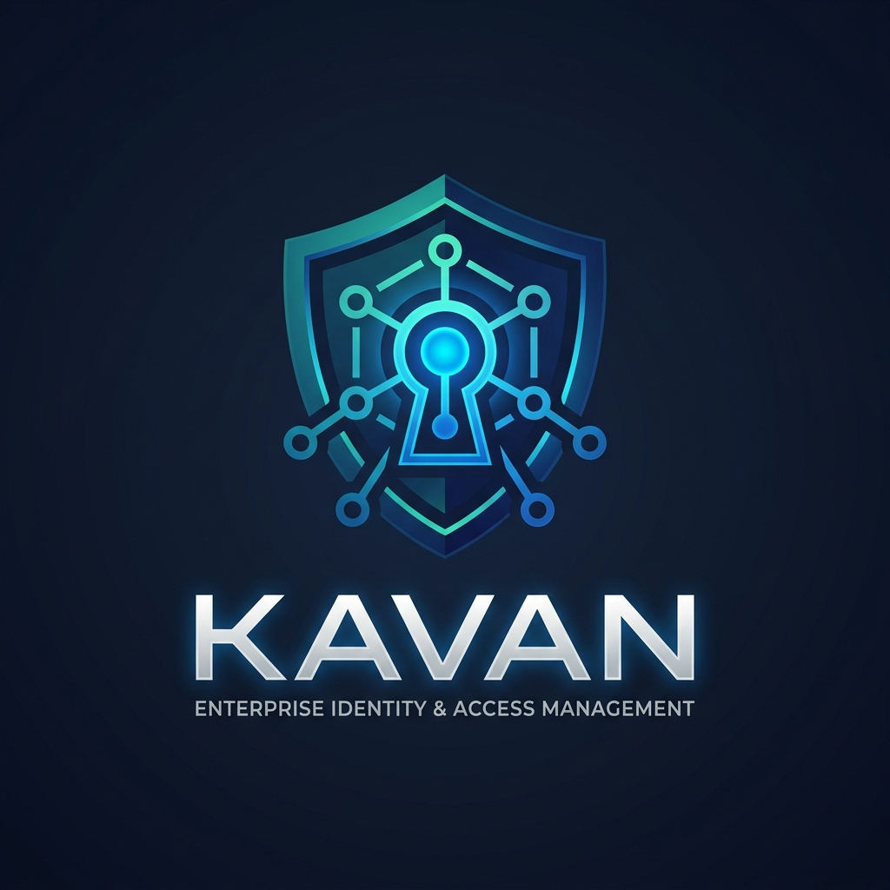
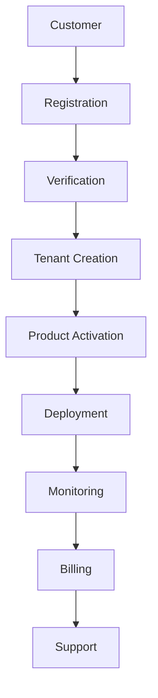
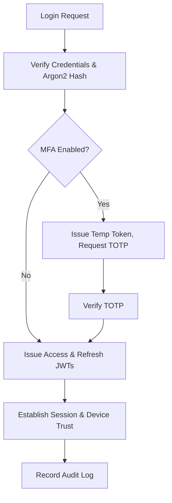
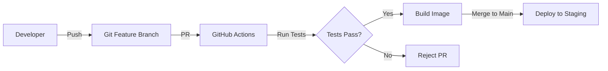

# KAVAN v5.2 – Enterprise Identity & Access Management Platform



[](https://python.org)
[](https://djangoproject.com)
[](https://postgresql.org)
[](https://redis.io)
[](https://docker.com)
[](LICENSE)
[](#)
[](#)
[](#)

*   **Current Version**: v5.2.0
*   **License**: MIT
*   **Documentation**: Enterprise Engineering Handbook

---

## 2. Executive Summary

### What is KAVAN
KAVAN is an enterprise-grade, highly secure, and multi-tenant product launch and management platform. Engineered using a decoupled Clean Architecture pattern, it provides a robust, scalable, and highly observable foundation for SaaS applications.

### Why KAVAN exists
Many default frameworks tightly couple business logic to their ORMs or HTTP components. KAVAN breaks this dependency by introducing the Repository and Service patterns. This allows developers to swap database drivers, caching servers, or external services without mutating core identity and business logic.

### Business Problem
Managing identity verification, secure sessions, multi-factor challenges, role mappings, and tenant isolation at scale is complex and error-prone when built monolithically. Enterprises need a reliable foundation to build products without reinventing authentication and infrastructure.

### Business Solution & Enterprise Value
KAVAN provides a secure, decoupled foundation that integrates easily with client portals and internal services. It allows teams to focus on business features (like product catalogs and analytics) while KAVAN handles asymmetric JWT issuance, immutable auditing, concurrent session controls, and tenant isolation.

### Target Customers
B2B Enterprise SaaS providers, organizations requiring strict data isolation, and development teams needing a production-ready, clean-architecture Python backend.

---

## 3. Table of Contents

1. [Professional Header](#kavan-v52--enterprise-identity--access-management-platform)
2. [Executive Summary](#2-executive-summary)
3. [Table of Contents](#3-table-of-contents)
4. [Platform Overview](#4-platform-overview)
5. [Business Workflow](#5-business-workflow)
6. [System Architecture](#6-system-architecture)
7. [Layer Architecture](#7-layer-architecture)
8. [Technology Stack](#8-technology-stack)
9. [Feature Matrix](#9-feature-matrix)
10. [Repository Structure](#10-repository-structure)
11. [Backend Architecture](#11-backend-architecture)
12. [Frontend Architecture](#12-frontend-architecture)
13. [Database Architecture](#13-database-architecture)
14. [Authentication Flow](#14-authentication-flow)
15. [Multi-Tenant Architecture](#15-multi-tenant-architecture)
16. [Security Architecture](#16-security-architecture)
17. [Monitoring & Observability](#17-monitoring--observability)
18. [API Documentation](#18-api-documentation)
19. [Configuration](#19-configuration)
20. [Local Development](#20-local-development)
21. [Running Services](#21-running-services)
22. [Testing](#22-testing)
23. [Code Quality](#23-code-quality)
24. [Git Workflow](#24-git-workflow)
25. [Development Standards](#25-development-standards)
26. [Deployment](#26-deployment)
27. [CI/CD Pipeline](#27-cicd-pipeline)
28. [Troubleshooting](#28-troubleshooting)
29. [Performance](#29-performance)
30. [Threat Model](#30-threat-model)
31. [Future Roadmap](#31-future-roadmap)
32. [Contributing](#32-contributing)
33. [License](#33-license)
34. [Credits](#34-credits)
35. [Appendix](#35-appendix)

---

## 4. Platform Overview

KAVAN operates as an **Enterprise Cloud Operating System** serving as the foundation for a larger **Product Ecosystem Platform**.

*   **Multi-Tenant SaaS**: Logical data isolation allowing multiple organizations (tenants) to use the same database while ensuring data cannot leak between them.
*   **Split-Plane Architecture**: The control plane (management) is decoupled from the data plane (tenant operations).
*   **Zero-Trust Design**: Every request must be authenticated, authorized, and logged, regardless of origin.
*   **Closed-Source Product Hosting**: Designed to securely host proprietary business logic while providing a standard API layer.

---

## 5. Business Workflow

The complete customer lifecycle is managed seamlessly through KAVAN:



---

## 6. System Architecture

KAVAN uses a modern distributed architecture ensuring high availability and secure data boundaries.

### High-Level Split-Plane Architecture
```
        [ Client Request (HTTPS) ]
                   │
                   ▼
         [ Nginx Reverse Proxy ]
                   │
                   ▼
          [ Gunicorn Server ]
                   │
                   ▼
      [ Django Middleware Pipeline ]
                   │
                   ▼
        [ Django REST Views (Controllers) ]
                   │
                   ▼
      [ Service Layer (Domain Logic) ]
                   │
                   ▼
      [ Repository Layer (Data Access) ]
                   │
    +──────────────┴──────────────+
    │                             │
    ▼                             ▼
[ PostgreSQL (Tenants) ]     [ Redis (Cache/Queue) ]
```

---

## 7. Layer Architecture

KAVAN is built in sequential layers to ensure stability before expanding features.

| Layer | Component Description | Status | Completion |
| :--- | :--- | :--- | :--- |
| Layer 1 | Infrastructure & Clean Architecture | Complete | 100% |
| Layer 2 | IAM (Identity & Access Management) | In Progress | 80% |
| Layer 3 | Multi-Tenant Engine | Pending | 0% |
| Layer 4 | Advanced RBAC | Pending | 0% |
| Layer 5 | Business Modules (Product Catalog) | Pending | 0% |
| Layer 6 | Security (Probes, Advanced Policies) | Pending | 0% |
| Layer 7 | Monitoring & Observability Stack | Pending | 0% |
| Layer 8 | AI Platform (Integrations) | Pending | 0% |
| Layer 9 | Deployment (Kubernetes, Helm) | Pending | 0% |
| Layer 10 | Enterprise Expansion (SSO, SAML) | Pending | 0% |

---

## 8. Technology Stack

### Backend
*   **Framework**: Django 5.0.6, Django REST Framework 3.15.2
*   **Language**: Python 3.10+
*   **Config**: Python-Decouple

### Frontend (Future)
*   **Core**: React 18
*   **Build Tool**: Vite
*   **Routing**: React Router

### Database & Storage
*   **Primary DB**: PostgreSQL 16+
*   **Driver**: Psycopg2-binary
*   **Object Storage**: AWS S3 (planned)

### Authentication & Security
*   **Tokens**: PyJWT (RS256)
*   **Hashing**: Argon2-cffi
*   **MFA**: PyOTP (TOTP)
*   **Encryption**: Cryptography 43.0.0

### Queue & Caching
*   **Broker**: Redis 7+
*   **Task Queue**: Celery 5.4.0
*   **Scheduler**: Django-Celery-Beat

### Documentation & Monitoring
*   **Docs**: drf-spectacular (OpenAPI/Swagger)
*   **Metrics**: Psutil
*   **Alerting**: Prometheus / Grafana (future)

### Testing & Deployment
*   **Testing**: Pytest, Pytest-Cov
*   **Server**: Gunicorn, Nginx
*   **Containers**: Docker Compose

---

## 9. Feature Matrix

*   [x] **Authentication**: Custom user model with secure password hashing.
*   [x] **MFA**: Standard TOTP implementation with backup recovery codes.
*   [x] **Audit Logs**: Append-only auditing for tracking authentication milestones.
*   [x] **Device Tracking**: Verifies known browser signatures and flags anomalous setups.
*   [x] **Password History**: Prevents reuse of recent passwords.
*   [x] **JWT**: Asymmetric tokens signed with private RSA keys.
*   [x] **Refresh Tokens**: Token rotation and invalidation on reuse.
*   [ ] **Tenant Isolation**: (Layer 3) Data partitioning.
*   [x] **Monitoring**: Custom health check endpoints.

---

## 10. Repository Structure

```
kavan/
├── .env                        # Active local decoupling variables
├── .env.template               # Template outlining default application settings
├── docker-compose.yml          # Container configuration for local testing
├── README.md                   # Core repository documentation
│
└── backend/                    # Root folder containing backend source files
    ├── manage.py               # Django utility for executing tasks
    ├── requirements.txt        # Production dependency definitions
    ├── requirements-dev.txt    # Additional developer tools
    │
    ├── config/                 # Central settings and core router configurations
    │   ├── settings/           # Settings files grouped by environment
    │   ├── auth_config.py      # Layer 2 IAM security parameters
    │   ├── api_router.py       # Central routing logic for API modules
    │   └── celery.py           # Background queue instance setup
    │
    ├── apps/                   # Custom Django modules (layered components)
    │   ├── authentication/     # Core user records, JWT validation, and logins
    │   ├── accounts/           # Password lifecycle management
    │   ├── health/             # Dependency health checker module
    │   └── audit/              # Records administrative and security events
    │
    └── common/                 # Reusable domain utilities
        ├── models/             # Shared base models (BaseModel, SoftDeleteModel)
        ├── repositories/       # Shared repository interfaces
        ├── services/           # Base services for Clean Architecture
        └── logging/            # Structured logging formatting logic
```

*   **apps/**: Contains the isolated feature modules.
*   **common/**: Contains the core building blocks for the Clean Architecture (Repositories, Services, DTOs).
*   **config/**: Framework configuration, deployment settings, and wiring.

---

## 11. Backend Architecture

KAVAN adheres to **Clean Architecture**.

*   **Django Apps**: Act purely as the presentation/delivery mechanism (HTTP controllers/views).
*   **Service Layer**: Encapsulates all business rules. Views pass requests to Services; Services orchestrate operations and return results.
*   **Repository Layer**: Abstracts the Django ORM. Services call Repositories to fetch or save data.
*   **Middleware**: Handles cross-cutting concerns like assigning `X-Request-ID`, standardizing exceptions, and injecting tenant context.
*   **Signals**: Used sparingly for decoupled events (e.g., audit logging).
*   **Validators & Serializers**: DRF serializers are used strictly for data validation and formatting, never for business logic.
*   **Permissions**: DRF permission classes enforce Layer 4 RBAC rules before requests reach the view.

---

## 12. Frontend Architecture (Planned)

*   **React + Vite**: For blazing-fast development and optimized production builds.
*   **Routing**: React Router for SPA navigation.
*   **State Management**: Zustand or Redux Toolkit for global state, React Query for server state.
*   **API Integration**: Axios instances configured with interceptors to handle JWT refresh token rotation automatically.
*   **Folder Structure**: Feature-sliced design (`features/`, `components/`, `layouts/`, `services/`).

---

## 13. Database Architecture

*   **Entity Relationships**: Designed for tenant isolation. Every tenant-owned model has a `tenant_id` foreign key.
*   **Core Models**: Inherit from `BaseModel` (provides UUID `id`, `created_at`, `updated_at`).
*   **UUID Strategy**: UUIDv4 used exclusively for primary keys to prevent ID enumeration.
*   **Tenant Relationships**: Global models (e.g., global admin users) vs. Tenant models (e.g., tenant customers).
*   **Indexing Strategy**: Indexes on `tenant_id` combined with frequently queried fields (e.g., `(tenant_id, email)`) to optimize partitioned queries.

---

## 14. Authentication Flow



---

## 15. Multi-Tenant Architecture (Layer 3)

*   **Tenant Resolution**: Middleware parses the request (via subdomain, e.g., `tenant1.kavan.com`, or `X-Tenant-ID` header) to identify the tenant.
*   **Tenant Context**: The resolved tenant is injected into `request.tenant` and a thread-local context variable.
*   **Tenant Isolation**: Repositories automatically apply global filters based on the thread-local tenant context to prevent cross-tenant data leaks.
*   **Custom Domains**: Support for mapping custom domains to specific tenant IDs.

---

## 16. Security Architecture

*   **Argon2**: Memory-hard hashing for passwords.
*   **JWT (RS256)**: Asymmetric signing. The API server signs tokens with a private key; other microservices can verify them using the public key.
*   **Redis Deny List**: Revoked or logged-out JWTs are added to a Redis blocklist until they expire.
*   **MFA**: Time-based One-Time Passwords (TOTP).
*   **Device Tracking**: Fingerprinting to detect anomalous login locations/devices.
*   **Rate Limiting**: Throttling via Redis to prevent brute-force attacks.
*   **Audit Logging**: Immutable tracking of security events.
*   **Vault**: (Future) HashiCorp Vault for secrets management.

---

## 17. Monitoring & Observability

*   **Logging**: JSON structured logging including `request_id` and `correlation_id` for tracing across microservices.
*   **Health Checks**: `/api/health/` provides deep checks against PostgreSQL, Redis, and Celery.
*   **Metrics**: Custom middleware tracks response times and payload sizes.
*   **Prometheus & Grafana**: (Future) Exporting metrics for visual dashboarding and alerting based on SLAs.

---

## 18. API Documentation

KAVAN exposes self-documenting APIs:

*   `/api/docs/`: Interactive Swagger UI.
*   `/api/schema/`: Raw OpenAPI v3 Schema.
*   `/api/redoc/`: ReDoc viewer.
*   `/api/health/`: System health status.
*   **API Versioning**: All endpoints are versioned, typically starting with `/api/v1/`.
*   **Response Format**: Standardized JSON envelope `{"success": true, "message": "...", "data": {...}}`.
*   **Error Format**: Standardized error envelope `{"success": false, "error": {"code": "...", "message": "...", "details": {...}}}`.

---

## 19. Configuration

All configuration is managed via `.env` file to comply with Twelve-Factor App principles.

### Database
| Variable | Description |
| :--- | :--- |
| `DB_ENGINE` | Relational SQL adapter |
| `DB_NAME` | Database name |
| `DB_USER` | Database user |
| `DB_PASSWORD` | User password credentials |
| `DB_HOST` | Database host IP/domain |
| `DB_PORT` | Database port (5432) |

### Redis & Celery
| Variable | Description |
| :--- | :--- |
| `REDIS_URL` | Primary Redis address mapping |
| `CELERY_BROKER_URL` | Task queue broker endpoint |
| `CELERY_RESULT_BACKEND` | Task result storage endpoint |

### Security & JWT
| Variable | Description |
| :--- | :--- |
| `SECRET_KEY` | Cryptographic signing token |
| `JWT_ISSUER` | Issuer value in token payload |
| `JWT_ACCESS_TOKEN_TTL` | Access token lifespan (seconds) |
| `JWT_PRIVATE_KEY_PATH` | Server private key path |
| `SESSION_MAX_CONCURRENT` | Maximum active client sessions |

### Monitoring
| Variable | Description |
| :--- | :--- |
| `LOG_LEVEL` | Logger filters (DEBUG, INFO) |
| `LOG_FILE` | Destination file for logs |

---

## 20. Local Development

These setup steps assume a local deployment without Docker. Ensure Python 3.10+, PostgreSQL 16+, and Redis 7+ are active on your system. All instructions assume commands are run from the `backend/` directory.

### Step 1: Virtual Environment Configuration
Create an isolated Python environment to manage dependencies:
```powershell
# Create the virtual environment (first time only)
python -m venv venv

# Activate it (Windows PowerShell)
.\venv\Scripts\Activate.ps1

# Activate it (Linux / macOS)
source venv/bin/activate
```
*Explanation: This isolates Python packages from your system-wide Python installation.*

### Step 2: Install Project Dependencies
Install standard requirements and development tools:
```powershell
# Install all production + dev dependencies
pip install -r requirements.txt
pip install -r requirements-dev.txt
```
*Explanation: Ensures you have Django, DRF, Celery, and testing tools like pytest installed.*

### Step 3: Configure Environment Variables
Create a local `.env` configuration file from the template:
```powershell
# Windows PowerShell
Copy-Item ..\.env.template ..\.env

# Linux / macOS
cp ../.env.template ../.env
```
Open `.env` (located in the project root directory) and configure the local host parameters:
```env
# Database (local PostgreSQL)
DB_HOST=localhost
DB_PORT=5432
DB_NAME=kavan_db
DB_USER=kavan_user
DB_PASSWORD=kavan_secure_password

# Redis (local)
REDIS_URL=redis://localhost:6379/0
CELERY_BROKER_URL=redis://localhost:6379/0
CELERY_RESULT_BACKEND=redis://localhost:6379/1

# Security
SECRET_KEY=your-secret-key-here
DEBUG=True
DJANGO_SETTINGS_MODULE=config.settings.local
```
*Explanation: These variables connect the application to your local infrastructure components.*

### Step 4: Setup the PostgreSQL Database
Access your PostgreSQL server shell (`psql` or pgAdmin) and run:
```sql
CREATE DATABASE kavan_db;
CREATE USER kavan_user WITH PASSWORD 'kavan_secure_password';
GRANT ALL PRIVILEGES ON DATABASE kavan_db TO kavan_user;
```
*Explanation: Provisions the local database and user required by the application.*

### Step 5: Execute Database Migrations
Apply schemas to the database:
```powershell
python manage.py migrate --settings=config.settings.local
```
*Explanation: Generates the necessary SQL tables based on Django models.*

---

## 21. Running Services

Open three separate terminals with the virtual environment activated in each. Navigate to the `backend/` directory.

### 1. Django API Server (Gunicorn in Production)
The core web API server handles incoming HTTP requests:
```powershell
python manage.py runserver --settings=config.settings.local
```
*In production, this is managed by Gunicorn behind Nginx.*

### 2. Celery Worker
Processes long-running asynchronous tasks from the Redis broker:
```powershell
celery -A config.celery worker --loglevel=info
```
*Executes emails, webhook deliveries, and log rotation.*

### 3. Celery Beat
Triggers scheduled/periodic cron tasks:
```powershell
celery -A config.celery beat --loglevel=info
```

### Supporting Services
*   **PostgreSQL**: Stores persistent relational data.
*   **Redis**: Caches database queries, manages Celery queues, and stores JWT deny lists.
*   **Nginx**: (Production only) Handles SSL termination and acts as a reverse proxy to Gunicorn.

---

## 22. Testing

*   **Unit Tests**: Mock the database layer to purely test business logic in Services and Utility functions.
*   **Integration Tests**: Use a test database to verify the full HTTP Request -> Middleware -> View -> Service -> Repository -> DB cycle.
*   **Security Tests**: Validate JWT expiration, permission boundaries, and rate limits.
*   **Performance Tests**: Load testing via Locust (future) to verify SLAs.

Run the test suite:
```powershell
pytest --settings=config.settings.local -v
pytest --settings=config.settings.local --cov=apps --cov-report=term-missing
```

---

## 23. Code Quality

Maintained through strict linters and formatters:
*   **Black**: PEP8 compliant opinionated formatter. (`black .`)
*   **isort**: Sorts imports alphabetically and into sections. (`isort .`)
*   **Flake8**: Catches syntax errors and style violations.
*   **Ruff**: Extremely fast alternative linter.
*   **MyPy**: Enforces static type checking across the Python codebase. (`mypy .`)
*   **Pre-commit Hooks**: Prevent commits that fail formatting or linting checks.

---

## 24. Git Workflow

We use a standard branching model:
*   `main`: Stable, production-ready code.
*   `develop`: Active development branch. Integration point for features.
*   `feature/*`: Branch for developing new features.
*   `bugfix/*`: Branch for resolving bugs.
*   `release/*`: Branch for preparing a new version for production.
*   `hotfix/*`: Branch for urgent production fixes.

**Conventional Commits**: Required for all commits (e.g., `feat(auth): implement MFA verification`).

---

## 25. Development Standards

*   **SOLID**: Components must have a single responsibility.
*   **DRY (Don't Repeat Yourself)**: Reusable components belong in `common/`.
*   **KISS (Keep It Simple, Stupid)**: Avoid over-engineering solutions before they are needed.
*   **Clean Architecture**: Never place business logic in Views or Serializers.
*   **Repository Pattern**: All database queries must be wrapped in Repository classes.
*   **Service Layer**: All domain rules exist here.
*   **Dependency Injection**: Use IoC containers to inject repositories into services for easy mocking.

---

## 26. Deployment

### Production Ubuntu Topology
*   **Nginx**: Edge proxy handling HTTPS and static assets.
*   **Gunicorn**: WSGI application server managing a pool of worker processes running the Django app.
*   **Systemd**: Manages Gunicorn, Celery Worker, and Celery Beat processes.
*   **Docker Compose**: Used for staging and simplified enterprise deployments.

*Note: All original deployment scripts and commands from Layer 1 remain functional.*

---

## 27. CI/CD Pipeline



---

## 28. Troubleshooting

*   **Database Connection Refused**: Check if PostgreSQL service is running and credentials in `.env` are correct.
*   **Redis Errors**: Verify Redis is accessible on `localhost:6379`.
*   **Celery Tasks Not Firing**: Ensure both the `worker` and `beat` processes are running, and Redis is active.
*   **Port Conflicts**: If `8000` is in use, find the PID (`lsof -i :8000`) and kill it.
*   **Migration Issues**: If schemas mismatch, try `python manage.py makemigrations` and `python manage.py migrate`.
*   **Permissions/403 Errors**: Check if your user account has the required role mappings and that your JWT token isn't expired.
*   **Virtual Environment Missing Modules**: Ensure you activated the venv and ran `pip install -r requirements.txt`.
*   **Static Files**: Run `python manage.py collectstatic` in production environments.

---

## 29. Performance

*   **Caching**: Redis caches frequently accessed resources (like user profiles or product catalogs).
*   **Indexes**: Database indexes are strategically placed on foreign keys and search fields.
*   **Pagination**: All list endpoints use cursor or page-number pagination to limit payload sizes.
*   **Bulk Operations**: Use `bulk_create` and `bulk_update` in Repositories for large datasets.
*   **Query Optimization**: `select_related` and `prefetch_related` are strictly used in Repositories to prevent N+1 query problems.
*   **Target Response Times**: < 200ms for standard API calls.

---

## 30. Threat Model

*   **Assets**: User credentials, PII, tenant business data, product catalogs.
*   **Attack Surface**: Public API endpoints, JWT token theft, brute force login, cross-tenant data access.
*   **Threats**: SQL Injection, XSS, CSRF, Account Takeover.
*   **Security Controls**: Django ORM sanitization, rate-limiting, MFA, strict tenant context middleware, JWT signature verification, HSTS headers.
*   **Risk Mitigation**: Security probes and automated vulnerability scanning in the CI/CD pipeline.

---

## 31. Future Roadmap

KAVAN is actively expanding its capabilities:
*   **Layer 3**: Multi-Tenant architecture roll-out.
*   **Layer 4**: Advanced RBAC permission engine.
*   **Layer 5**: Core Product Management modules.
*   **Layer 6+**: Advanced workflows, auditing, notifications, AI expansions, and Enterprise integrations.

---

## 32. Contributing

We welcome contributions!
1. Check the issue tracker for open tasks.
2. Follow the **Branch Policy** (`feature/`, `bugfix/`).
3. Ensure all code passes `black`, `flake8`, and `pytest`.
4. Submit a **Pull Request** to `develop`.
5. Code Review: Two approvals required for core architectural changes.

---

## 33. License

This project is licensed under the terms of the MIT License.

```
MIT License

Copyright (c) 2026 KAVAN Technologies

Permission is hereby granted, free of charge, to any person obtaining a copy
of this software and associated documentation files (the "Software"), to deal
in the Software without restriction, including without limitation the rights
...
```

---

## 34. Credits

*   **Owner**: KAVAN Core Development Team
*   **Lead Architect**: Enterprise IAM Initiative Team
*   **Core Team**: System Engineers
*   **Contributors**: Open Source Community

---

## 35. Appendix

### Useful Commands
```bash
# Create a superuser
python manage.py createsuperuser

# Enter Django shell
python manage.py shell

# Generate a new Secret Key
python -c "from django.utils.crypto import get_random_string; print(get_random_string(50))"
```

### Checklists
*   **Development Checklist**: Write tests, format code, verify types.
*   **Release Checklist**: Update CHANGELOG, bump version, tag release.
*   **Production Checklist**: Verify `DEBUG=False`, strong `SECRET_KEY`, setup TLS/SSL.

### Reference Links
*   [Django Documentation](https://docs.djangoproject.com/)
*   [Django REST Framework](https://www.django-rest-framework.org/)
*   [Celery Project](https://docs.celeryq.dev/)