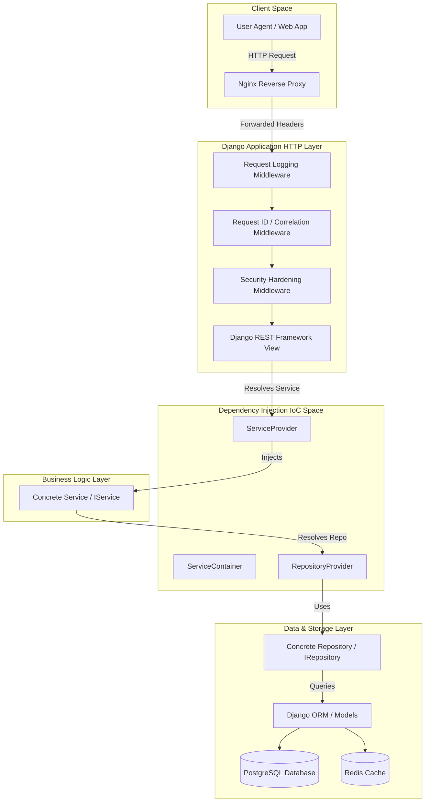
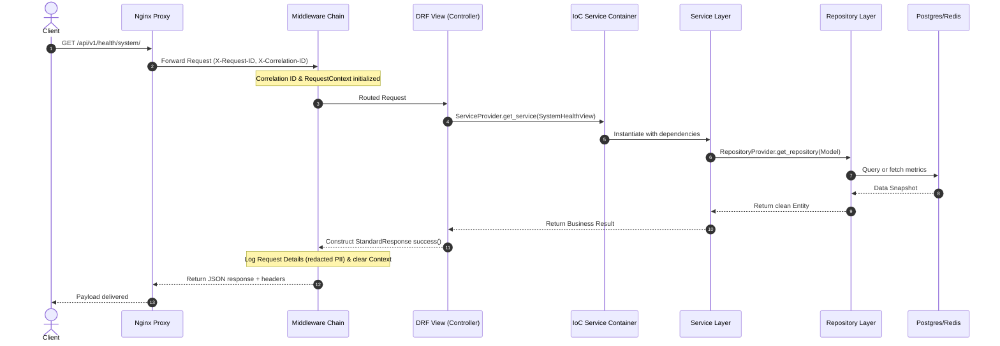
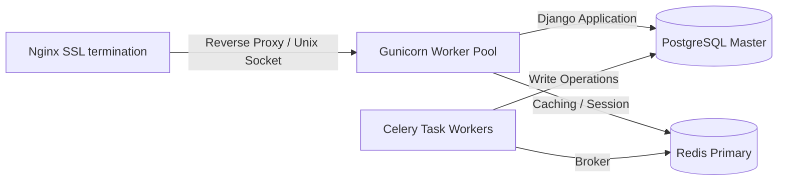

# KAVAN v6.0 — Architecture Documentation

This document describes the design architecture, layer mapping, and structural layout of KAVAN v6.0.

---

## 1. Clean Architecture Layers

KAVAN is built using clean architecture boundaries designed to preserve a high degree of decoupling. The application enforces a strict separation between controllers, interfaces, business processes, and data access.

---

## 2. Request Processing Flow (Sequence)

---

## 3. Deployment Topology

